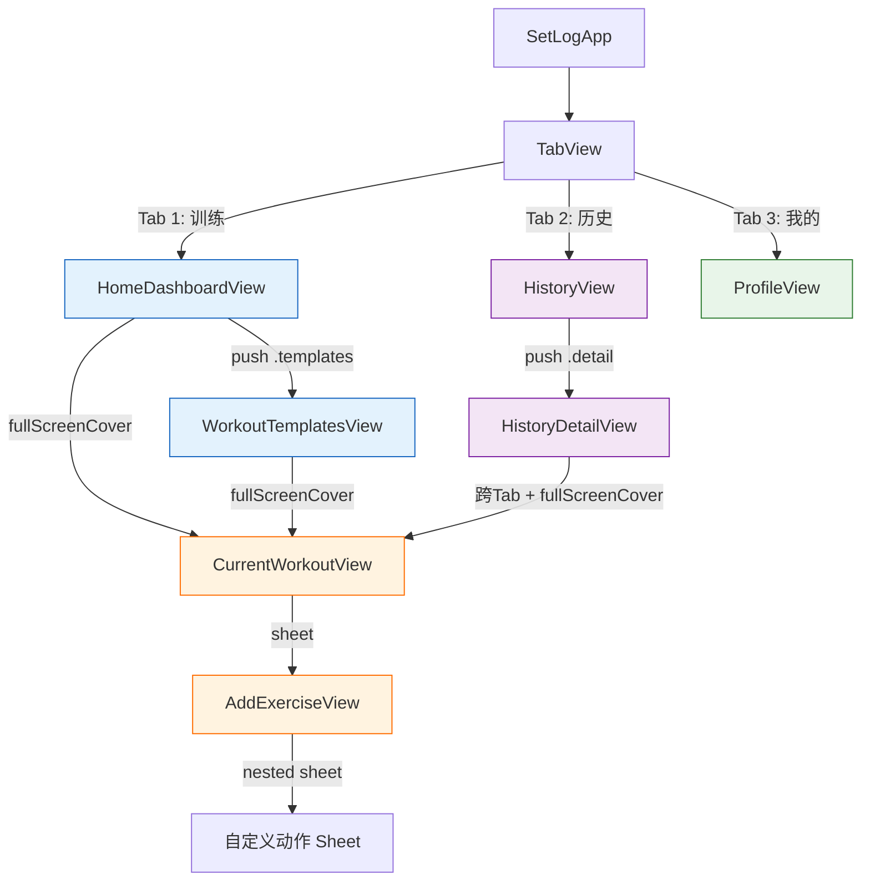
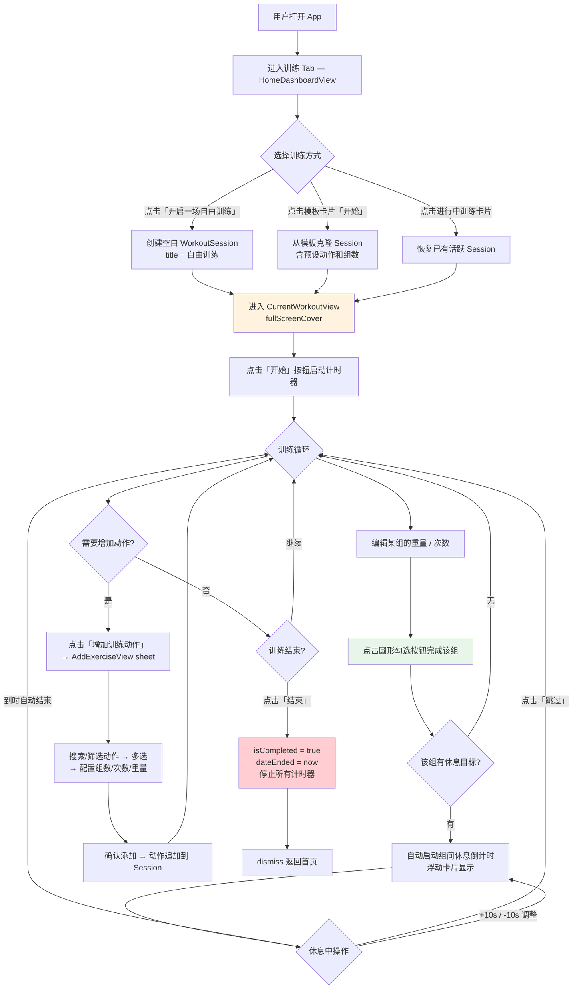
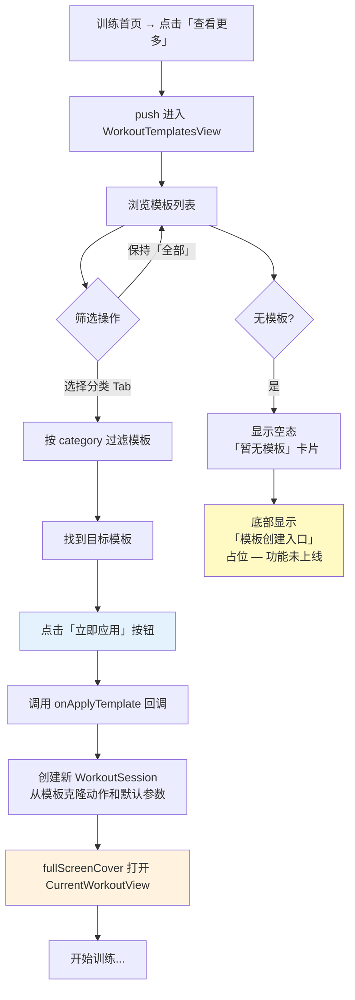
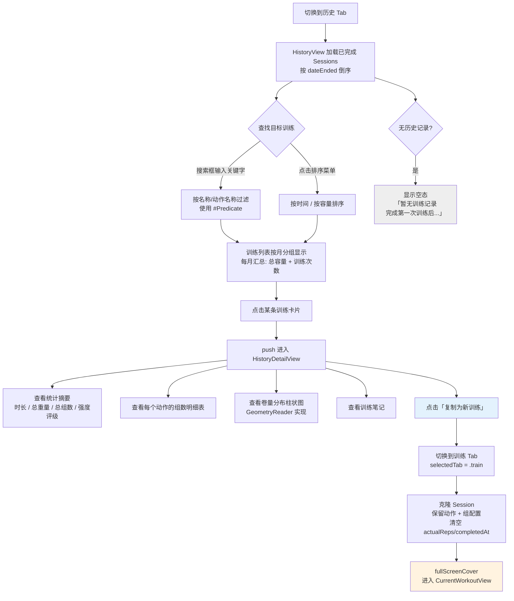
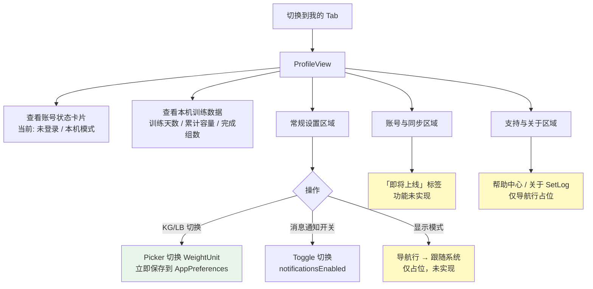

# SetLog iOS App — 逆向设计与原型文档

> **生成日期**: 2026-04-04
> **代码版本**: `main` 分支 (`4a6424b`)
> **分析范围**: 全部 Swift 源码（11 个文件）、SwiftData 模型、资源文件

---

## 目录

- [A. 应用设计总览](#a-应用设计总览)
- [B. 信息架构（IA）](#b-信息架构ia)
- [C. 关键用户流程](#c-关键用户流程)
- [D. 页面级原型说明（低保真）](#d-页面级原型说明低保真)
- [E. 设计规范提取](#e-设计规范提取)
- [F. 重构建议](#f-重构建议)
- [附录: 代码证据索引](#附录-代码证据索引)

---

## A. 应用设计总览

### App 定位

**SetLog 是一款面向力量训练爱好者的本地训练记录工具，聚焦"记组"核心体验，支持模板化训练流程和历史复盘。**

### 功能模块清单

| 模块 | 职责 | 核心文件 |
|------|------|----------|
| 训练仪表盘 | 今日概览（日历、统计）、快速开始训练、模板快捷入口 | `ContentView.swift` — `HomeDashboardView` |
| 当前训练 | 实时记录组数/重量/次数、自动计时、组间休息倒计时 | `CurrentWorkoutView.swift` |
| 添加动作 | 从动作库选择/搜索/自定义动作，配置默认参数 | `AddExerciseView.swift` |
| 训练模板 | 浏览、筛选、应用预设训练计划 | `WorkoutTemplatesView.swift` |
| 历史记录 | 按月分组的已完成训练列表，支持搜索和排序 | `HistoryView.swift` |
| 训练详情 | 单次训练的完整回顾（统计、动作明细、卷量分布图、笔记） | `HistoryDetailView.swift` |
| 个人中心 | 账号状态、本机统计、设置（单位/通知/显示模式） | `ProfileView.swift` |
| 数据层 | SwiftData 模型定义、种子数据、重量单位换算 | `Item.swift` |
| 主题 | 全局颜色常量定义（当前未被引用） | `AppTheme.swift` |
| App 入口 | ModelContainer 初始化、种子数据注入 | `SetLogApp.swift` |

### 技术栈与架构模式

| 维度 | 选型 |
|------|------|
| **UI 框架** | SwiftUI（纯 SwiftUI，少量 UIKit 桥接 `UIViewRepresentable`） |
| **持久化** | SwiftData（`@Model`, `ModelContainer`, `@Query`） |
| **架构模式** | **View-centric**（非严格 MVVM）— 业务逻辑直接写在 View 的 private 方法中，没有独立 ViewModel 层 |
| **导航** | `NavigationStack` + typed path（`TrainRoute` / `HistoryRoute`）+ `TabView` |
| **状态管理** | `@State` / `@Query` / `@Environment(\.modelContext)` |
| **最低版本** | iOS 17+（推断：使用了 `#Predicate`、SwiftData、`@Query`） |
| **语言** | Swift（100%），界面文案为中文 |
| **网络** | 无（纯本地应用，无 API 调用） |
| **账号系统** | 占位设计，当前硬编码 `.guest`（`ProfileView.swift:16`） |

### 数据模型概览

```
AppPreferences (单例)
├── weightUnit: String  (默认 "kg")
├── notificationsEnabled: Bool
└── displayMode: String

WorkoutSession
├── title: String
├── dateStarted / dateEnded: Date
├── workoutTimerStartedAt / workoutElapsedOffset / workoutIsRunning (计时器状态)
├── notes: String
├── templateName: String?
├── isCompleted: Bool
└── exercises: [WorkoutExercise] (cascade)
    ├── name / category / order
    ├── session → WorkoutSession (反向)
    └── sets: [WorkoutSet] (cascade)
        ├── index / targetReps / actualReps
        ├── weightKg / isCompleted / completedAt
        ├── restDurationTarget / restDurationActual
        └── exercise → WorkoutExercise (反向)

WorkoutTemplate
├── title / category / level / estimatedDuration
├── createdAt
└── exercises: [TemplateExercise] (cascade)
    ├── name / symbolName / order
    ├── defaultSets / defaultReps / defaultWeightKg / defaultRestSeconds
    └── template → WorkoutTemplate (反向)

ExerciseCatalogItem (动作目录)
├── name / category / symbolName
├── defaultSets / defaultReps / defaultWeightKg / defaultRestSeconds
└── isCustom: Bool
```

> **证据**: `Item.swift:1-200`，所有 `@Model` 类定义

---

## B. 信息架构（IA）

### 页面树

```
SetLogApp (入口)
├── TabView (3 个 Tab)
│   ├── Tab 1: 训练 (train)
│   │   └── NavigationStack<TrainRoute>
│   │       ├── HomeDashboardView (根页面)
│   │       │   ├── → WorkoutTemplatesView (push via .templates)
│   │       │   ├── → CurrentWorkoutView (fullScreenCover)
│   │       │   │   └── → AddExerciseView (sheet)
│   │       │   │       └── → 自定义动作 Sheet (嵌套 sheet)
│   │       │   └── 日历卡片 / 统计卡片 / 模板卡片
│   │       └── WorkoutTemplatesView
│   │           └── → CurrentWorkoutView (fullScreenCover)
│   │
│   ├── Tab 2: 历史 (history)
│   │   └── NavigationStack<HistoryRoute>
│   │       ├── HistoryView (根页面)
│   │       └── HistoryDetailView (push via .detail(sessionId))
│   │           └── → CurrentWorkoutView (跨 Tab 跳转到 train)
│   │
│   └── Tab 3: 我的 (profile)
│       └── NavigationStack
│           └── ProfileView (根页面, 无子页面)
```

### 每个页面明细

| 页面 | 入口 | 出口 | 依赖数据 | 主要操作 |
|------|------|------|----------|----------|
| **HomeDashboardView** | Tab 切换 | → Templates(push)、→ CurrentWorkout(cover) | `WorkoutSession`(全部+活跃)、`WorkoutTemplate`、`AppPreferences` | 快速开始训练、打开进行中训练、查看模板、从模板开始 |
| **CurrentWorkoutView** | fullScreenCover | dismiss / 完成训练 | `WorkoutSession`(当前)、`AppPreferences` | 开始/暂停/结束训练、勾选组完成、编辑重量/次数/休息、增加组、增加动作、删除动作/训练、管理组间休息倒计时 |
| **AddExerciseView** | sheet from CurrentWorkout | dismiss(确认/取消) | `ExerciseCatalogItem`、`WorkoutSession`(当前)、`AppPreferences` | 搜索/筛选动作、多选动作、配置组数/次数/重量、调整顺序、创建自定义动作 |
| **WorkoutTemplatesView** | push from Home | → CurrentWorkout(cover) | `WorkoutTemplate` | 筛选分类、应用模板开始训练 |
| **HistoryView** | Tab 切换 | → HistoryDetail(push) | `WorkoutSession`(已完成)、`AppPreferences` | 搜索训练记录、按时间/容量排序、查看详情 |
| **HistoryDetailView** | push from History | → CurrentWorkout(跨Tab)、dismiss | `WorkoutSession`(指定ID)、`AppPreferences` | 查看训练统计与明细、复制为新训练 |
| **ProfileView** | Tab 切换 | 无子页 | `AppPreferences`、`WorkoutSession`(全部) | 切换重量单位(KG/LB)、开关通知、查看累计统计 |

### 页面导航图 (Mermaid)



### 导航 Route 枚举定义

```swift
// ContentView.swift
enum TrainRoute: Hashable {
    case templates  // → WorkoutTemplatesView
}

enum HistoryRoute: Hashable {
    case detail(PersistentIdentifier)  // → HistoryDetailView
}
```

---

## C. 关键用户流程

### 流程 1: 自由训练闭环（核心主流程）

**前置条件**: 无（本地应用，无需登录）



**异常分支**:
- **中途关闭页面** → Session 保留为"进行中"，下次打开可恢复（`ContentView.swift:217` 检测活跃 session）
- **删除训练** → 菜单"删除该训练" → destructive 操作直接删除 Session 并 dismiss（`CurrentWorkoutView.swift:419-428`）
- **App 进入后台** → 持久化休息计时状态到 `WorkoutSet.restSnapshot*`（`CurrentWorkoutView.swift:583`）
- **App 恢复前台** → 从快照恢复休息倒计时（`CurrentWorkoutView.swift:547-576`）

---

### 流程 2: 模板浏览与应用

**前置条件**: 已有模板数据（种子数据自动注入）



**异常分支**:
- 无模板数据 → 显示空态卡片 + 创建入口占位（`WorkoutTemplatesView.swift:92-146`）

---

### 流程 3: 历史复盘与复刻训练

**前置条件**: 至少有 1 条已完成的训练记录



**异常分支**:
- 无历史记录 → 空态文案（`HistoryView.swift:145`）
- Session ID 找不到 → 显示「未找到训练详情」占位视图（`HistoryDetailView.swift:47`）

---

### 流程 4: 个人设置管理

**前置条件**: 无



---

## D. 页面级原型说明（低保真）

### D1. HomeDashboardView — 训练首页

```
┌─────────────────────────────────────┐
│            今日训练 (居中标题)          │  ← topBar, 白色背景, h=56
├─────────────────────────────────────┤
│                                     │
│ ┌────────────┐  ┌─────────────────┐ │
│ │ 日历卡片     │  │  统计卡片        │ │  ← HStack, 白色圆角卡片
│ │ 四  五 ← 月  │  │  总时长   00m   │ │
│ │ ■  □  □  □  │  │  已完成   0     │ │
│ │ □  □  □  □  │  │  总组数   0     │ │
│ │ □  □  ★  □  │  │  总容量   0 kg  │ │  ← ★ = 今日
│ │ □  □  □  □  │  │                 │ │
│ └────────────┘  └─────────────────┘ │
│                                     │
│ ┌─────────────────────────────────┐ │  ← 条件: 有活跃 Session
│ │ 🏋️ 有正在进行的训练               │ │
│ │ 胸部训练          00:12:34    → │ │  ← 橙色背景, 计时器实时更新
│ └─────────────────────────────────┘ │
│                                     │
│ ┌─────────────────────────────────┐ │  ← 条件: 有今日已完成训练
│ │ ✅ D1 Push A      完成于 14:30  │ │
│ │    75 分钟 · 4200 kg · 16 组    │ │
│ └─────────────────────────────────┘ │
│                                     │
│ ┌ ─ ─ ─ ─ ─ ─ ─ ─ ─ ─ ─ ─ ─ ─ ─┐ │
│ │  🏋️ 开启一场自由训练           → │ │  ← 虚线边框, 点击创建空白Session
│ └ ─ ─ ─ ─ ─ ─ ─ ─ ─ ─ ─ ─ ─ ─ ─┘ │
│                                     │
│ 训练模板                    查看更多→  │  ← sectionHeader
│ ┌─────────────────────────────────┐ │
│ │ D1 Push A                      │ │  ← TrainingTemplateCard
│ │ 上次使用: 3天前                  │ │
│ │ [🔥杠铃] [🔥哑铃] [△肩推] ...   │ │  ← 动作图标网格
│ │ 预计 75min             [▶ 开始] │ │
│ └─────────────────────────────────┘ │
│ (最多显示 3 个模板卡片)               │
│                                     │
│ 没有灵感?                            │
│ 从浏览热门模板开始…                   │
└─────────────────────────────────────┘
```

**状态矩阵**:

| 状态 | 表现 | 代码证据 |
|------|------|---------|
| 空态（无活跃训练） | 隐藏进行中卡片区域 | `ContentView.swift:311` `if let activeSession` |
| 空态（无今日完成） | 隐藏已完成列表区域 | `ContentView.swift:330` `if !todayCompleted.isEmpty` |
| 空态（无模板） | 显示「暂无模板」占位卡片 | `ContentView.swift:413-432` |
| 有活跃 Session | 显示橙色进行中卡片，计时器每秒刷新 | `ContentView.swift:313-328`, Timer `234` |

**交互规则**:

| 触发 | 操作 | 结果 |
|------|------|------|
| 点击「开启一场自由训练」 | `startFreeSession()` | 创建空白 Session → fullScreenCover |
| 点击进行中卡片 | `showWorkout = true` | fullScreenCover 恢复训练 |
| 点击已完成训练卡片 | NavigationLink | push 到 HistoryDetailView |
| 点击模板「开始」 | `startFromTemplate(template)` | 从模板克隆 Session → fullScreenCover |
| 点击「查看更多」 | push `.templates` | 导航到 WorkoutTemplatesView |
| 计时器 | `Timer.publish(every: 1)` | 每秒触发 UI 刷新 |

---

### D2. CurrentWorkoutView — 训练中

```
┌─────────────────────────────────────┐
│ ←  [胸部训练] [力量模式]  [...] [结束] │  ← stickyHeader, 白色背景
│                                     │
│         00:12:34                    │  ← 计时器, monospacedDigit
│    进度: 4/8 组   体积: 1,200 kg     │
├─────────────────────────────────────┤
│                                     │
│ ┌─────────────────────────────────┐ │  ← ExerciseEditorCard
│ │ 杠铃卧推                  [···] │ │
│ │ 2 / 4 组已完成                  │ │
│ │                                 │ │
│ │ 组  重量    次数    休息    状态  │ │  ← 表头行
│ │ ─────────────────────────────── │ │
│ │ 1   60 kg   10     90s    ✅   │ │  ← 绿色勾, 已完成
│ │ 2   60 kg   10     --     ✅   │ │
│ │ 3  [65 kg] [8    ] [90s]   ○   │ │  ← 可编辑输入, 未完成
│ │ 4  [65 kg] [8    ] [--]    ○   │ │
│ │ 5  [+]     [+]    [+]     ◌   │ │  ← 添加新组行
│ │                                 │ │
│ │         📝 点击增加动作备注...    │ │  ← 占位, 功能未实现
│ └─────────────────────────────────┘ │
│                                     │
│ ┌─────────────────────────────────┐ │
│ │ 更多动作卡片...                  │ │
│ └─────────────────────────────────┘ │
│                                     │
│ ┌─────────────────────────────────┐ │
│ │      + 增加训练动作               │ │  ← 灰色虚线按钮
│ └─────────────────────────────────┘ │
│                                     │
│ ——— END OF WORKOUT PLAN ———        │
│                                     │
│ ┌───────────────────────────────┐   │  ← 浮动卡片, 条件显示
│ │  ⏱ 78s   [-10s] [+10s] [跳过] │   │  ← 休息倒计时
│ └───────────────────────────────┘   │
└─────────────────────────────────────┘
```

**状态矩阵**:

| 状态 | 按钮样式 | 证据 |
|------|---------|------|
| 未开始 | 「开始」绿色背景 | `CurrentWorkoutView.swift:504` |
| 进行中 | 「结束」橙色背景 | `CurrentWorkoutView.swift:504` |
| 暂停后 | 「继续」绿色背景 | 推断：`workoutIsRunning` toggle |
| 有活跃休息 | 底部浮动休息倒计时卡片 | `CurrentWorkoutView.swift:518-540` |

**交互规则**:

| 触发 | 操作 | 效果 |
|------|------|------|
| 点击圆形勾选按钮 | `toggleCompletion(set)` | toggle 组完成 + 触觉反馈 `UINotificationFeedbackGenerator` |
| 点击重量/次数单元格 | `SelectAllTextField` 激活 | 自动全选文本, 方便快速输入 |
| 重量编辑确认 | `weightKg = convertedWeight` | 自动换算 KG/LB 后存储 |
| 组完成时有休息目标 | 自动启动休息倒计时 | 显示浮动卡片 |
| 休息卡片 +10s / -10s | 调整 `restDurationTarget` | 轻触觉反馈 `UIImpactFeedbackGenerator(.light)` |
| 休息「跳过」 | `skipRest()` | 记录实际休息秒数, 关闭倒计时 |
| 菜单 [...] | 展开 contextMenu | 「删除该训练」destructive 选项 |
| App 进入后台 | `persistRestSnapshot()` | 持久化休息计时状态到 SwiftData |
| App 恢复前台 | `restoreRestFromSnapshot()` | 从快照恢复倒计时 |
| 添加组行 `+` 按钮 | `appendNewSet()` | 复制上一组参数, 追加新行 |

---

### D3. AddExerciseView — 添加动作

```
┌─────────────────────────────────────┐
│ ← 添加动作                    自定义  │  ← 导航栏
├─────────────────────────────────────┤
│ 🔍 搜索动作名称...                    │  ← 搜索框
│ [全部] [胸部] [腿部] [背部] [肩部]     │  ← 分类 Capsule 横滑标签
├─────────────────────────────────────┤
│                                     │
│ 常用动作                    已选 2 项  │  ← Section 标题
│ ┌─────────────────────────────────┐ │
│ │ 🔥  杠铃卧推       胸大肌    ①  │ │  ← 选中: 橙色边框 + 序号
│ │ 🏋️  深蹲          股四头肌   ②  │ │
│ │ 🔥  上斜哑铃卧推    胸大肌       │ │  ← 未选中: 灰色
│ │ 🏋️  腿举          股四头肌       │ │
│ │ ...                              │ │
│ └─────────────────────────────────┘ │
│                                     │
├─────────────────────────────────────┤
│ 🏋️ 默认参数设置         [KG] [LB]   │  ← 单位切换器
│ 已选 2 个动作…                       │
│                                     │
│ 已选动作:                            │
│ ┌─────────────────────────────────┐ │
│ │ ① 杠铃卧推   4组 · 8次 · 60KG  │ │  ← SelectedExerciseRow
│ │                        [↑][↓][×]│ │  ← 排序/删除按钮
│ │ ② 深蹲      4组 · 6次 · 100KG  │ │
│ │                        [↑][↓][×]│ │
│ └─────────────────────────────────┘ │
│                                     │
│ 组数  [-]  4  [+]                   │  ← AdjustableParameterField
│ 次数  [-]  8  [+]                   │
│ 重量  KG  [ 60____________ ]        │  ← 数字输入框
│ 休息  [-]  90s  [+]                 │
│                                     │
├─────────────────────────────────────┤
│ ┌─────────────────────────────────┐ │
│ │       确认添加动作 (2)       →   │ │  ← 黑色主按钮
│ └─────────────────────────────────┘ │
└─────────────────────────────────────┘
```

**状态矩阵**:

| 状态 | 表现 | 证据 |
|------|------|------|
| 空态（搜索无结果） | 「没有找到匹配动作」+ 创建自定义动作按钮 | `AddExerciseView.swift:228-251` |
| 未选任何动作 | 底部按钮灰色禁用, 文案「请选择动作」 | `AddExerciseView.swift:335-336` |
| 已选 1+ 动作 | 显示参数配置区 + 按钮启用 | `AddExerciseView.swift:252-358` |
| 重量输入无效 | 红色提示「请输入有效重量」 | `AddExerciseView.swift:329` |

**自定义动作 Sheet**:

| 字段 | 类型 | 验证 |
|------|------|------|
| 动作名称 | TextField | 非空 + 不重复 |
| 身体部位 | Picker (胸/背/腿/肩/手臂/核心) | 必选 |
| 默认组数 | Stepper (1-10) | 默认 4 |
| 默认次数 | Stepper (1-30) | 默认 8 |
| 默认重量 | NumberField | 默认 20 |

---

### D4. WorkoutTemplatesView — 训练模板

```
┌─────────────────────────────────────┐
│            训练模板                    │  ← topBar, 居中, h=56
├─────────────────────────────────────┤
│                                     │
│ 发现模板                             │  ← size 34, weight .black
│ 根据你的目标选择合适的计划              │  ← 副标题, .secondary
│                                     │
│ [全部] [Push] [Pull] [Legs]          │  ← 横滑分类标签
├─────────────────────────────────────┤
│                                     │
│ ┌─────────────────────────────────┐ │  ← WorkoutTemplateCard
│ │ D1 Push A                   →  │ │
│ │ 🕐 75 分钟    🔥 计划          │ │
│ │                                 │ │
│ │ [🔥] [🔥] [△] [△]      Push   │ │  ← 动作图标 + 分类标签
│ │                                 │ │
│ │ ┌─────────────────────────────┐ │ │
│ │ │     ▶  立即应用              │ │ │  ← 黑色全宽按钮
│ │ └─────────────────────────────┘ │ │
│ └─────────────────────────────────┘ │
│                                     │
│ ┌ ─ ─ ─ ─ ─ ─ ─ ─ ─ ─ ─ ─ ─ ─ ─┐ │
│ │        ▶  模板创建入口           │ │  ← 虚线边框, 占位
│ │   下一步会开放自定义新模板        │ │  ← 功能未上线
│ └ ─ ─ ─ ─ ─ ─ ─ ─ ─ ─ ─ ─ ─ ─ ─┘ │
└─────────────────────────────────────┘
```

---

### D5. HistoryView — 历史记录

```
┌─────────────────────────────────────┐
│            历史记录                    │  ← topBar
├─────────────────────────────────────┤
│ 🔍 搜索训练记录...            [排序▼] │  ← 搜索框 + 排序菜单
│                                     │  ← 排序选项: 按时间/按容量
├─────────────────────────────────────┤
│                                     │
│ 2026年4月  📊 12,500kg  ✕ 3次       │  ← 月度汇总 Section Header
│ ┌─────────────────────────────────┐ │
│ │ 🏋️  D1 Push A           强力   │ │  ← HistoryRecordCard
│ │ 4月2日 周四 · 75 min            │ │
│ │              4,200 kg           │ │
│ │              4 个动作         →  │ │
│ └─────────────────────────────────┘ │
│ ┌─────────────────────────────────┐ │
│ │ 🏋️  腿部日               标准   │ │
│ │ 4月1日 周三 · 60 min            │ │
│ │              3,800 kg           │ │
│ │              3 个动作         →  │ │
│ └─────────────────────────────────┘ │
│                                     │
│ 2026年3月  📊 48,200kg  ✕ 12次      │
│ ...                                 │
│                                     │
│ ──── 已加载全部历史数据 ────          │
└─────────────────────────────────────┘
```

**状态矩阵**:

| 状态 | 表现 | 证据 |
|------|------|------|
| 空态 | 「暂无训练记录，完成第一次训练后，这里会显示你的训练历史」 | `HistoryView.swift:145-159` |
| 搜索无结果 | 同上空态（推断：filteredSessions 为空） | |
| 正常 | 按月分组, 每月显示汇总 | `HistoryView.swift:100-143` |

---

### D6. HistoryDetailView — 训练详情

```
┌─────────────────────────────────────┐
│ ← 训练详情                            │
├─────────────────────────────────────┤
│                                     │
│ 📅 2026年4月2日 星期四                 │  ← 日期
│ D1 Push A                           │  ← 训练名称, size 28, bold
│                                     │
│ ┌──────────────┐ ┌───────────────┐  │
│ │  ⏱ 总用时     │ │  ⚖️ 总重量     │  │  ← 2x2 指标网格
│ │  75 分钟      │ │  4,200 kg    │  │     DetailMetricCard
│ ├──────────────┤ ├───────────────┤  │
│ │  📋 总组数    │ │  💪 强度       │  │
│ │  16 组       │ │  高强度       │  │  ← 强度 = 总容量/总时长 评级
│ └──────────────┘ └───────────────┘  │
│                                     │
│ 训练动作                    4 个动作   │  ← Section
│ ┌─────────────────────────────────┐ │
│ │ 🔗 杠铃卧推               胸部  │ │  ← ExerciseGroupCard
│ │                                 │ │
│ │ 组号   重量     次数    完成时间  │ │
│ │ ───────────────────────────────│ │
│ │  1     60 kg    10     10:23   │ │
│ │  2     60 kg    10     10:26   │ │
│ │  3     65 kg     8     10:32   │ │
│ │  4     65 kg     8     10:38   │ │
│ └─────────────────────────────────┘ │
│ ┌─────────────────────────────────┐ │
│ │ 🔗 哑铃飞鸟               胸部  │ │
│ │ ...                             │ │
│ └─────────────────────────────────┘ │
│                                     │
│ 卷量分布 (kg)                        │  ← 柱状图 Section
│ ┌─────────────────────────────────┐ │
│ │ ████████████████  2400          │ │  ← 最大值全宽
│ │ 杠铃卧推                        │ │
│ │ ████████          1200          │ │
│ │ 哑铃飞鸟                        │ │
│ │ ██████            600           │ │
│ │ 肩推                            │ │
│ └─────────────────────────────────┘ │
│                                     │
│ 训练笔记                             │  ← 条件显示: 有笔记时
│ ┌─────────────────────────────────┐ │
│ │ 深蹲状态不错，下次把第三组        │ │
│ │ 提升到 102.5kg。                 │ │
│ └─────────────────────────────────┘ │
│                                     │
│ ┌─────────────────────────────────┐ │
│ │     🔄 复制为新训练               │ │  ← 黑色全宽按钮
│ └─────────────────────────────────┘ │
│                                     │
└─────────────────────────────────────┘
```

**交互规则**:

| 触发 | 效果 | 证据 |
|------|------|------|
| 点击「复制为新训练」 | 跨 Tab 切换到 train → 克隆 Session → fullScreenCover | `HistoryDetailView.swift:190-214` |
| Session 未找到 | 显示灰色占位「未找到训练详情」 | `HistoryDetailView.swift:47-54` |

---

### D7. ProfileView — 个人中心

```
┌─────────────────────────────────────┐
│            个人中心                    │
├─────────────────────────────────────┤
│                                     │
│ ┌─────────────────────────────────┐ │
│ │  🟠 (大头像, 橙色渐变)           │ │  ← 56x56 圆形
│ │     未登录                       │ │
│ │     当前以本机模式使用…           │ │
│ │     [本机使用中]                  │ │  ← Capsule 标签
│ │                                 │ │
│ │  ✅ 当前可直接使用训练记录功能     │ │
│ │  ☁️ 登录后自动补同步,无需担心     │ │
│ │                                 │ │
│ │ ┌─────────────────────────────┐ │ │
│ │ │ 登录与同步功能开发中 即将上线  │ │ │  ← 浅橙色横幅
│ │ └─────────────────────────────┘ │ │
│ └─────────────────────────────────┘ │
│                                     │
│ 本机训练数据               未登录     │  ← Section
│ ┌─────────────────────────────────┐ │
│ │ 📅 12天    ⚖️ 45,000kg   📋 186组│ │  ← ProfileStatView x3
│ │ 最近一次完成训练：2026年4月2日    │ │
│ └─────────────────────────────────┘ │
│                                     │
│ 未登录模式说明                       │  ← Section
│ ┌─────────────────────────────────┐ │
│ │ 当前训练记录和数据只保存在本设备  │ │
│ │ 登录账号后可开启云同步…           │ │
│ └─────────────────────────────────┘ │
│                                     │
│ 常规设置                             │  ← Section
│ ┌─────────────────────────────────┐ │
│ │ ⚖️ 单位切换        [KG | LB]   │ │  ← segmented SettingRowView
│ │ 🔔 消息通知        [开关]       │ │  ← toggle SettingRowView
│ │ 🌓 显示模式        跟随系统  →  │ │  ← navigation SettingRowView
│ └─────────────────────────────────┘ │
│                                     │
│ 账号与同步                            │
│ ┌─────────────────────────────────┐ │
│ │ 🔑 登录与同步       未登录   →   │ │
│ │ 💾 本机使用说明              →   │ │
│ └─────────────────────────────────┘ │
│                                     │
│ 支持与关于                            │
│ ┌─────────────────────────────────┐ │
│ │ ❓ 帮助中心                  →   │ │
│ │ ℹ️ 关于 SetLog   v1.0(1)    →   │ │
│ └─────────────────────────────────┘ │
│                                     │
│           🏋️ SETLOG                  │  ← 底部品牌 Footer
│      Guest mode supported.          │
└─────────────────────────────────────┘
```

---

## E. 设计规范提取

### E1. 颜色体系

#### 已定义颜色常量（AppTheme.swift，当前未被使用）

| Token 名 | 值 | 代码位置 |
|----------|-----|---------|
| `AppTheme.accent` | `Color("AccentOrange")` | `AppTheme.swift:10` |
| `AppTheme.pageBackground` | `Color(.systemGray6)` | `AppTheme.swift:13` |
| `AppTheme.cardBackground` | `Color(.systemBackground)` | `AppTheme.swift:16` |
| `AppTheme.cardBorder` | `Color(.systemGray5)` | `AppTheme.swift:19` |
| `AppTheme.primaryText` | `Color(.label)` | `AppTheme.swift:22` |
| `AppTheme.secondaryText` | `Color(.secondaryLabel)` | `AppTheme.swift:25` |
| `AppTheme.separator` | `Color(.separator)` | `AppTheme.swift:28` |

#### 实际使用颜色（硬编码，从代码中提取）

| 用途 | 值 | 出现位置 |
|------|-----|---------|
| **强调橙 A** | `Color.orange` | `CurrentWorkoutView.swift:504` |
| **强调橙 B** | `Color(red: 1.0, green: 0.45, blue: 0.08)` | `CurrentWorkoutView.swift:311` |
| **强调橙 C** | `Color(red: 1.00, green: 0.43, blue: 0.06)` | `CurrentWorkoutView.swift:226` |
| **页面背景** | `Color(.systemGray6)` | 所有页面 `.background()` |
| **卡片背景** | `.white` | 全局卡片 |
| **卡片边框** | `Color(.systemGray5)`, 1pt | 全局卡片 `.stroke()` |
| **近黑文本 A** | `Color(red: 0.10, green: 0.12, blue: 0.18)` | `CurrentWorkoutView.swift:144` |
| **近黑文本 B** | `Color(red: 0.14, green: 0.15, blue: 0.20)` | `CurrentWorkoutView.swift:634` |
| **副文本** | `.secondary` / `Color(red: 0.29, green: 0.32, blue: 0.38)` | 多处 |
| **分类选中** | `Color.black` bg + `.white` text | `AddExerciseView.swift:177`, `WorkoutTemplatesView.swift:82` |
| **按钮主色** | `Color.black` | `AddExerciseView.swift:349`, `HistoryDetailView.swift:198` |
| **绿色（开始）** | `Color.green` | `CurrentWorkoutView.swift:504` |
| **红色（删除）** | `.red` | `ProfileView.swift:293` |
| **渐变-头像** | `[orange, Color(red:1,g:0.45,b:0.08)]` | `ProfileView.swift:123-126` |
| **渐变-卡片** | `[white, Color(.systemGray6).opacity(0.5)]` | `ContentView.swift:561-565` |

> **设计债**: 橙色至少 3 种写法，文本近黑至少 2 种写法，均应统一到 `AppTheme`

### E2. 字体体系

| 层级 | 规格 | 使用场景 | 代码证据 |
|------|------|---------|---------|
| **XL 标题** | `.system(size: 34, weight: .black)` | 页面主标题「发现模板」 | `WorkoutTemplatesView.swift:62` |
| **L 标题** | `.system(size: 28, weight: .bold)` | 训练详情名称 | `HistoryDetailView.swift:80` |
| **M 标题** | `.system(size: 22~24, weight: .bold)` | 模板卡片名、统计大标题 | `WorkoutTemplateCard:167` |
| **TopBar** | `.system(size: 18, weight: .semibold)` | 所有页面顶部居中标题 | 全局 topBar |
| **Section** | `.system(size: 17, weight: .bold)` | 区块标题「训练动作」 | `HistoryDetailView.swift:99` |
| **Body/CTA** | `.system(size: 14~16, weight: .semibold)` | 按钮文字、列表项主文 | 多处 |
| **Caption** | `.system(size: 12, weight: .medium)` | 日期、描述、副标签 | 多处 |
| **Tag** | `.system(size: 10~11, weight: .bold)` | 分类标签、徽章 | `WorkoutTemplateCard:197` |
| **Timer** | `.system(size: 23, weight: .black, design: .rounded)` + `.monospacedDigit()` | 训练计时器 | `CurrentWorkoutView.swift:178` |
| **Stat Number** | `.system(size: 18~20, weight: .bold)` | 指标卡片数值 | `HistoryDetailView.swift:230` |
| **Param Number** | `.system(size: 24~26, weight: .black, design: .rounded)` | 组数/次数调节器 | `AddExerciseView.swift:854` |

### E3. 间距与圆角规范

#### 间距

| Token | 值 | 使用场景 |
|-------|-----|---------|
| **页面水平边距** | 16pt | 所有页面 `.padding(.horizontal, 16)` |
| **页面顶部间距** | 12~16pt | `.padding(.top, 12~16)` |
| **卡片内边距** | 14~16pt | `.padding(14~16)` |
| **卡片间距** | 12~18pt | `VStack(spacing: 12~18)` |
| **元素最小间距** | 4~8pt | 标题与副标题间 |

#### 圆角

| Token | 值 | 使用场景 |
|-------|-----|---------|
| **大卡片** | 18~22pt (continuous) | 训练卡片、模板卡片 |
| **中卡片** | 14~16pt (continuous) | 按钮、输入框 |
| **小圆角** | 10~12pt (continuous) | 图标背景、小卡片 |
| **Capsule** | 全圆角 | 分类标签、Tag 徽章 |

#### 阴影

| 使用场景 | 值 |
|---------|-----|
| 卡片外阴影 (轻) | `shadow(color: .black.opacity(0.03), radius: 8, y: 4)` |
| 卡片外阴影 (中) | `shadow(color: .black.opacity(0.06~0.10), radius: 12~18, y: 6~10)` |
| 浮动元素 | `shadow(color: .black.opacity(0.15), radius: 20, y: 10)` |

### E4. 图标体系

**全部使用 SF Symbols，无自定义图标资源**:

| 图标 | 用途 | 位置 |
|------|------|------|
| `figure.strengthtraining.traditional` | 训练 Tab、训练主图标 | Tab + 卡片 |
| `clock.arrow.circlepath` | 历史 Tab | Tab |
| `gearshape` | 个人中心 Tab | Tab |
| `flame.fill` | 胸部动作类别 | 动作列表 |
| `figure.pull.up` | 背部动作类别 | 动作列表 |
| `triangle.fill` | 肩部动作类别 | 动作列表 |
| `bolt.fill` | 手臂/核心动作类别 | 动作列表 |
| `figure.run` | 腿部动作类别 | 动作列表 |
| `checkmark` | 组完成标记 | 训练中 |
| `play` | 开始/应用模板 | 多处 CTA |
| `clock` | 时长标签 | 模板卡片 |
| `flame` | 强度/级别标签 | 模板卡片 |
| `plus` | 添加操作 | 添加组/动作 |
| `chevron.right` | 导航指示 | 列表行 |
| `magnifyingglass` | 搜索 | 搜索框 |
| `square.stack.3d.up` | 空态图标 | 模板空态 |

### E5. 可复用组件清单

| 组件名 | 类型 | 使用场景 | 文件位置 |
|--------|------|---------|---------|
| `StatusRow` | Stateless | 仪表盘统计单行（图标+标题+值） | `ContentView.swift:643` |
| `TrainingTemplateCard` | Stateless | 首页模板缩略卡片 | `ContentView.swift:576` |
| `HistoryRecordCard` | Stateless | 历史列表中的训练记录卡片 | `HistoryView.swift:166` |
| `ExerciseEditorCard` | Stateful | 训练中动作编辑器（含组列表） | `CurrentWorkoutView.swift:617` |
| `WorkoutSetRow` | Stateful | 单组数据行（重量/次数/休息/勾选） | `CurrentWorkoutView.swift:773` |
| `EditableInputCell` | Stateful | 训练中数值编辑单元格 | `CurrentWorkoutView.swift:844` |
| `SelectAllTextField` | UIViewRepresentable | 点击自动全选的文本输入框 | `CurrentWorkoutView.swift:868` |
| `RestAdjustButton` | Stateless | 休息时间 +10s/-10s 按钮 | `CurrentWorkoutView.swift:999` |
| `ExerciseOptionRow` | Stateless | 动作选择列表行 | `AddExerciseView.swift:704` |
| `SelectedExerciseRow` | Stateful | 已选动作排序行（含上下移动/删除） | `AddExerciseView.swift:767` |
| `AdjustableParameterField` | Stateful | ±步进参数调节器 | `AddExerciseView.swift:839` |
| `WorkoutTemplateCard` | Stateless | 模板库详情卡片（含应用按钮） | `WorkoutTemplatesView.swift:149` |
| `DetailMetricCard` | Stateless | 训练详情指标卡片（单个指标） | `HistoryDetailView.swift:220` |
| `ExerciseGroupCard` | Stateless | 训练详情动作组表格 | `HistoryDetailView.swift:248` |
| `SettingRowView` | Stateful | 设置列表行（segmented/toggle/nav） | `ProfileView.swift:368` |
| `ProfileStatView` | Stateless | 个人中心统计项 | `ProfileView.swift:336` |

### E6. 设计不一致项与设计债

#### 🔴 高优先级

| # | 问题 | 描述 | 证据 |
|---|------|------|------|
| H1 | **AppTheme 未被引用** | `AppTheme.swift` 定义了 7 个语义颜色常量，但所有页面使用硬编码颜色值，没有一处引用 `AppTheme` | `AppTheme.swift` vs 所有 View 文件 |
| H2 | **强调色不统一** | 橙色至少 3 种硬编码写法：`Color.orange`、`Color(red: 1.0, green: 0.45, blue: 0.08)`、`Color(red: 1.00, green: 0.43, blue: 0.06)` | `CurrentWorkoutView.swift:504` vs `:311` vs `:226` |
| H3 | **tagChip 尺寸冲突** | `tagChip` 同时设置了 `frame(width: 40, height: 15)` 和 `frame(width: 50, height: 17)`，前者被后者覆盖，导致意外尺寸 | `CurrentWorkoutView.swift:221-222` |
| H4 | **StickyHeader 标签硬编码** | 「胸部训练」「力量模式」标签是静态字符串，不随实际训练内容变化 | `CurrentWorkoutView.swift:152-153` |

#### 🟡 中优先级

| # | 问题 | 描述 | 证据 |
|---|------|------|------|
| M1 | **Combine Timer 依赖** | 多处使用 `Timer.publish` + `onReceive`，与项目偏好 async/await 不一致 | `ContentView.swift:234`, `CurrentWorkoutView.swift:100` |
| M2 | **PreviewModelContainer 重复** | 两个文件各有一份完全相同的 `PreviewModelContainer` 定义 | `CurrentWorkoutView.swift:1039`, `WorkoutTemplatesView.swift:238` |
| M3 | **ProfileWeightUnit 冗余** | `ProfileView` 定义了 `ProfileWeightUnit` 仅为桥接 `WeightUnit`，增加不必要间接层 | `ProfileView.swift:465` |
| M4 | **占位功能项无标识** | 显示模式、帮助中心、关于、登录同步、模板创建等均为占位 UI，无 disabled 状态或「即将上线」标记 | `ProfileView.swift:22,28-37` |
| M5 | **动作备注入口无功能** | 「点击增加动作备注...」文案存在但无交互实现 | `CurrentWorkoutView.swift:720-726` |
| M6 | **文本颜色不统一** | 近黑色文本至少 2 种 `Color(red:...)` 写法 | `CurrentWorkoutView.swift:144` vs `:634` |

#### 🟢 低优先级

| # | 问题 | 描述 | 证据 |
|---|------|------|------|
| L1 | **HistoryView 排序图标语义不当** | 月度汇总使用 `xmark.circle` 展示训练次数 | `HistoryView.swift:123` |
| L2 | **时长格式不完善** | `DashboardSummary.durationText` 仅显示分钟（如 `90m`），不处理小时 | `ContentView.swift:676` |
| L3 | **卡片圆角值分散** | 不同卡片使用 16/18/20/22 等多种圆角值，缺乏层级语义 | 全局 |
| L4 | **暗色模式未支持** | 大量 `.white` 硬编码背景，无法适配 dark mode | 全局 |

---

## F. 重构建议

### 架构问题清单

| # | 问题 | 影响范围 | 严重度 |
|---|------|---------|--------|
| 1 | **无 ViewModel 层** — 所有业务逻辑直接写在 View 的 private 方法中 | `CurrentWorkoutView`(1061行), `ContentView`(700+行), `AddExerciseView`(900+行) | 高 |
| 2 | **AppTheme 形同虚设** — 已定义但全局未使用 | 全局颜色一致性 | 高 |
| 3 | **导航逻辑混合在 View 中** — `ContentView` 同时承担路由、Session 创建、Tab 协调 | `ContentView.swift` | 中 |
| 4 | **重复代码** — `PreviewModelContainer`、颜色映射、时间格式化逻辑多处重复 | 维护成本 | 中 |
| 5 | **无单元测试** — `SetLogTests.swift` 和 `SetLogUITests.swift` 为空模板 | 代码质量 | 中 |
| 6 | **无暗色模式支持** — 大量 `.white` 硬编码 | 用户体验 | 低 |

### 🚀 快速改进项（1-2 周）

| # | 改进项 | 工作量 | 影响 |
|---|--------|--------|------|
| 1 | **统一使用 AppTheme** — 全局替换硬编码颜色为 `AppTheme.*`，修正橙色 3 种写法 | 2-3天 | 全局一致性，暗色模式基础 |
| 2 | **修复 tagChip 尺寸冲突** — 去掉 `CurrentWorkoutView.swift:221` 的重复 frame | 10分钟 | Bug 修复 |
| 3 | **StickyHeader 标签动态化** — 根据 `workout.exercises` 的 category 自动生成 | 1-2小时 | 数据准确性 |
| 4 | **抽取 PreviewModelContainer** — 移到公共文件消除重复 | 30分钟 | 代码整洁 |
| 5 | **去掉 ProfileWeightUnit** — 给 `WeightUnit` 添加 `CaseIterable` | 30分钟 | 代码简化 |
| 6 | **修复 HistoryView 图标** — `xmark.circle` → `number` 或其他语义图标 | 10分钟 | UI 语义正确 |
| 7 | **占位功能添加 disabled + 标识** — 给未实现功能加「即将上线」badge | 1-2小时 | 用户预期管理 |

### 📋 中期优化项（1-2 月）

| # | 优化项 | 说明 | 预期效果 |
|---|--------|------|---------|
| 1 | **引入 ViewModel / @Observable 层** | 将 `CurrentWorkoutView` 的计时器管理、CRUD、休息逻辑抽取到 `@Observable WorkoutSessionViewModel`。目标: View < 200行 | 可测试性、可维护性大幅提升 |
| 2 | **抽取导航协调器** | 将 `ContentView` 中 Session 创建和跨 Tab 跳转抽取到 `AppCoordinator`（`@Observable`） | 降低 ContentView 复杂度 |
| 3 | **设计系统组件化** | 建立 `DesignSystem/` 目录，统一 `CardContainer`、`SectionHeader`、`ActionButton` 等基础组件，定义圆角层级: Small=12, Medium=16, Large=20 | 消除 20+ 处重复样式 |
| 4 | **暗色模式支持** | 基于 AppTheme 语义颜色，替换所有 `.white` 为 `AppTheme.cardBackground`，测试 dark appearance | 用户体验提升 |
| 5 | **实现占位功能** | 模板创建/编辑、动作备注、显示模式切换、帮助中心 | 产品完整度 |
| 6 | **添加核心单元测试** | 针对 `WorkoutSession` 计算属性、`Double.convertedWeight`、`SampleDataSeeder` | 代码质量保障 |
| 7 | **用 async/await 替换 Combine Timer** | 使用 `Task` + `AsyncTimerSequence` 替代 `Timer.publish().onReceive` | 技术栈一致性 |
| 8 | **国际化准备** | 提取所有中文硬编码字符串到 `.strings` / String Catalog | 扩展市场基础 |

---

## 附录: 代码证据索引

### 文件清单与职责

| 文件 | 行数 | 职责 |
|------|------|------|
| `SetLogApp.swift` | ~30 | App 入口, ModelContainer 初始化 |
| `ContentView.swift` | ~700 | TabView + 训练首页 + 路由 + Session 管理 |
| `CurrentWorkoutView.swift` | ~1061 | 训练中页面（最大文件，含计时器/休息/CRUD） |
| `AddExerciseView.swift` | ~900 | 添加动作页面（搜索/选择/配置/自定义创建） |
| `WorkoutTemplatesView.swift` | ~260 | 训练模板列表 |
| `HistoryView.swift` | ~250 | 历史记录列表（搜索/排序/分组） |
| `HistoryDetailView.swift` | ~320 | 训练详情（统计/明细/图表/复制） |
| `ProfileView.swift` | ~480 | 个人中心（账号/统计/设置） |
| `Item.swift` | ~640 | 全部 SwiftData Model + 种子数据 + 工具方法 |
| `AppTheme.swift` | ~30 | 颜色常量定义（未被引用） |

### 关键方法索引

| 方法 | 位置 | 功能 |
|------|------|------|
| `startFreeSession()` | `ContentView.swift:~450` | 创建空白训练 Session |
| `startFromTemplate(_:)` | `ContentView.swift:~470` | 从模板克隆训练 Session |
| `toggleCompletion(_:)` | `CurrentWorkoutView.swift:~440` | 切换组完成状态 + 触发休息 |
| `persistRestSnapshot()` | `CurrentWorkoutView.swift:~583` | 持久化休息计时状态 |
| `restoreRestFromSnapshot()` | `CurrentWorkoutView.swift:~547` | 恢复休息计时状态 |
| `confirmAddExercises()` | `AddExerciseView.swift:~400` | 确认添加选中动作到 Session |
| `cloneToNewSession()` | `HistoryDetailView.swift:~190` | 复制历史训练为新 Session |
| `SampleDataSeeder.seedIfNeeded(in:)` | `Item.swift:~480` | 注入种子数据（动作目录+模板） |
| `ensurePreferences()` | `ProfileView.swift:~326` | 确保 AppPreferences 存在 |

---

> **文档说明**: 本文档基于代码静态分析自动生成，所有结论均标注了代码证据（文件路径 + 行号）。标注「推断」的部分基于代码模式推理而非直接证据。建议配合实际运行截图一起用于产品评审。
