<div align="center">

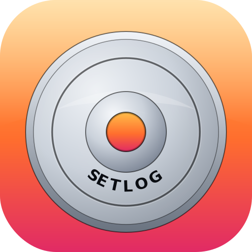

# SetLog

**A SwiftUI + SwiftData workout tracker for serious lifters.**
Set‑by‑set logging with RPE, rest timing, periodization, and templates — all offline.

[简体中文](README.zh-CN.md) · [日本語](README.ja.md) · **English**

[](https://www.apple.com/ios/)
[](https://swift.org)
[](https://developer.apple.com/xcode/swiftui/)
[](https://developer.apple.com/documentation/swiftdata)
[](LICENSE)

</div>

---

## Overview

**SetLog** is an iOS workout logger built around the real workflow of strength training: warmup ramps, RPE‑graded working sets, deliberate rest intervals, and structured weekly splits. It is offline‑first (SwiftData), keyboard‑optimized (custom numeric keypad), and ships with a full 5‑day split program out of the box.

<!-- TODO: Replace with hero image. The original `screenshots/light/01-home-dashboard.png` works well as a hero. -->
<p align="center">
  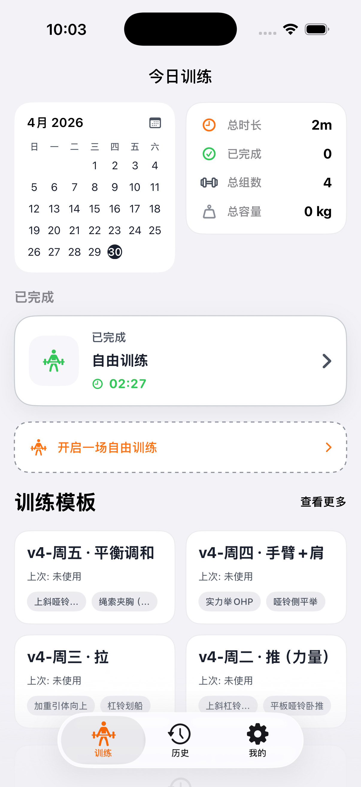
</p>

---

## Features

### Workout logging
- **Live session timer** with pause/resume — total elapsed time and per‑set timestamps are recorded.
- **Set‑by‑set tracking**: target reps vs. actual reps, weight (kg or lb), RPE 6–10, rest seconds, completion timestamp.
- **Set types**: distinct `warmup` and `working` styling so a 4‑set ramp doesn't dilute your volume metrics.
- **Per‑session notes** (e.g. _"Squat felt sharp, push set 3 to 102.5kg next week."_).
- **Deload mode**: a session can be flagged as deload — preferred weights and template save‑back are skipped so a lighter day doesn't pollute your defaults.

### Periodization (Macrocycle / Mesocycle)
- Stack multiple **mesocycles** (hypertrophy / strength / etc.) inside a **macrocycle program**.
- Per‑week load multiplier, deload week flag, RPE cap, target rep range.
- A built‑in setup wizard scaffolds the standard 4–6 week mesocycle structure.

### Templates & Daily Plans
- Ships with the **v4 5‑day split**: 周一·腿 (Mon · Legs), 周二·推 (Tue · Push, strength), 周三·拉 (Wed · Pull), 周四·手臂+肩 (Thu · Arms + Shoulders), 周五·平衡调和 (Fri · Balance).
- **DailyPlan** lets you override a template just for one date without rewriting the template itself.
- Templates auto‑inherit your "preferred weight" from the last completed session of each exercise.

### Exercise catalog
- **60+ pre‑seeded exercises** across six categories: chest, back, legs, shoulders, arms, core.
- Add custom exercises with SF‑Symbol icons and color tints.
- Per‑exercise:
  - **Weight mode**: `standard` (barbell / machine total) or `singleHand` (dumbbell per‑side; doubled internally for volume).
  - **Bodyweight inclusion**: weighted pull‑ups / dips can fold the user's bodyweight into the volume math.

### Custom numeric keypad
A 4×4 keypad replaces the system keyboard for weight/rep entry — with haptics and four action keys:

| Key | Behavior |
|---|---|
| Dismiss | Collapse the keypad |
| Copy → | Copy the current value to the next set on the right |
| Fill ↓ | Fill the current value into every empty cell below |
| Confirm | Commit and advance focus |

### History & analytics
- **Calendar** view, **list** view, per‑session **detail** view.
- Aggregates: total training days, cumulative volume (KG/LB‑aware), total completed sets, last workout date.
- Per‑session breakdown of exercises, sets, RPE distribution, and volume.

### Export (Markdown / CSV / JSON)
- Three formats, three date ranges (all‑time / last 7 days / last 30 days / custom).
- **JSON** is round‑trippable — the same schema is used by the bundled demo data.
- **CSV** is BOM‑prefixed so Excel auto‑detects UTF‑8.
- **Markdown** is shareable to Notes / Bear / Obsidian / GitHub directly.

### Rest timer & notifications
- Auto‑starts on set completion, pauseable, with per‑set custom duration.
- Posts a local notification (`rest-timer-complete`) when it expires so you can put your phone down between sets.

### UI polish
- Native **dark mode** throughout (an orange accent is used across both themes).
- **SF Symbols** for exercise icons.
- Drag‑to‑reorder exercises mid‑session.
- iPad‑friendly (Universal device family).

---

## Demo data

The first launch seeds **14 real training sessions** from `SetLog/DemoSessions.json` (2026‑04‑24 → 2026‑05‑14, a full mesocycle of the v4 5‑day split):

| Metric | Value |
|---|---|
| Sessions | 14 |
| Total sets | 260 |
| Total volume | **89,017 kg** |
| Time span | 3 weeks |
| Categories covered | Chest · Back · Legs · Shoulders · Arms · Core |
| Features exercised | Warmup ramps, RPE 6–10, custom rest, bodyweight pull‑ups & dips, single‑hand mode, in‑progress session |

The last session (2026‑05‑14, _v4‑周四·手臂+肩_) is left **unfinished** on purpose — open the Train tab and you can step into a live workout immediately.

> The seed is JSON; replace the contents of `SetLog/DemoSessions.json` with your own export and the next clean install will use yours.

---

## Screenshots

<details open>
<summary><strong>Light mode</strong></summary>

| Home | Templates | Template detail | Add exercise |
|---|---|---|---|
|  | 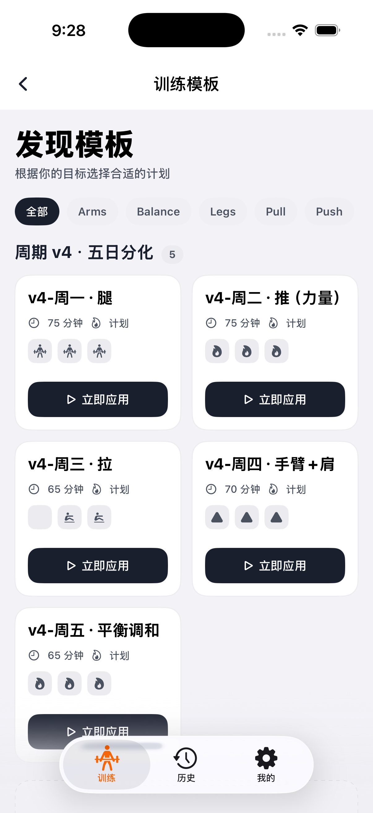 | 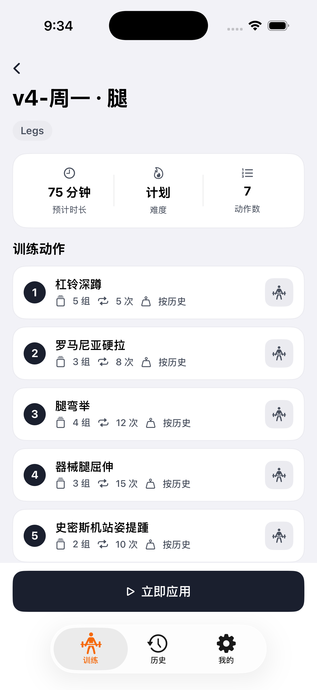 | 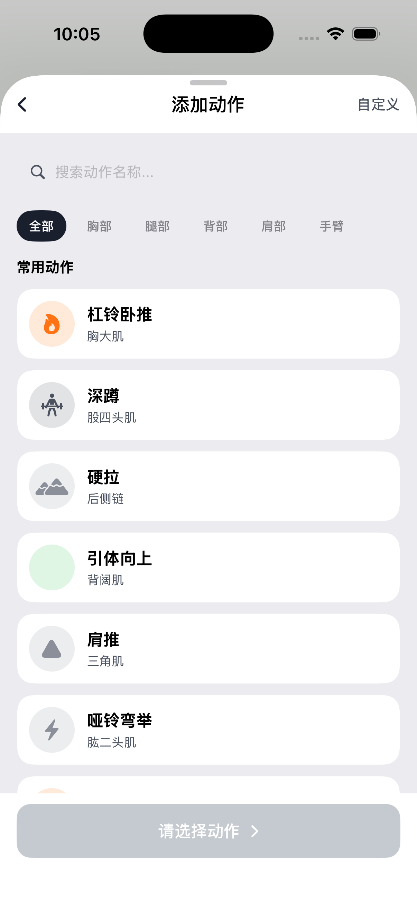 |

| Current workout | Workout running | Workout summary | Profile |
|---|---|---|---|
| 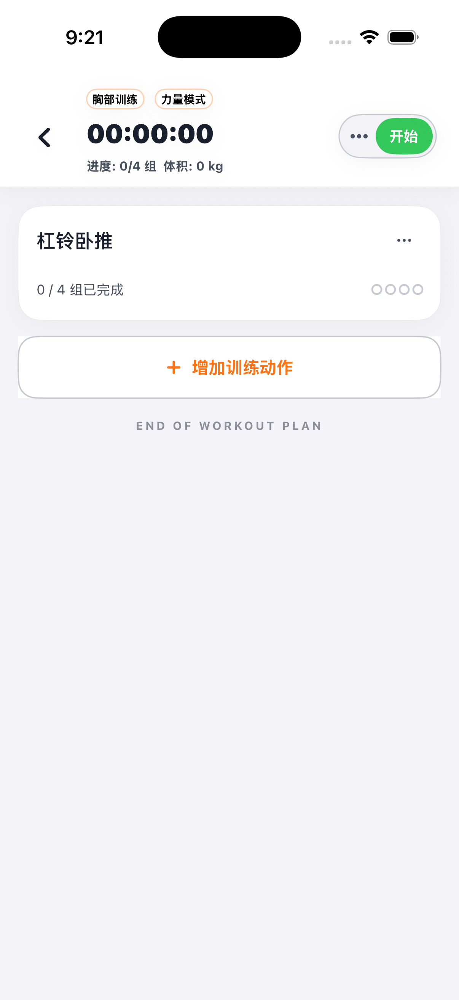 | 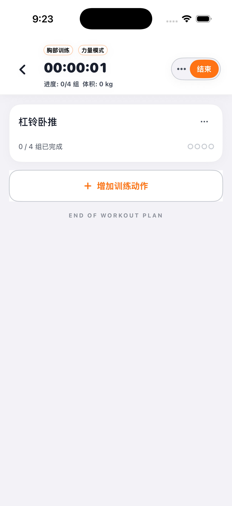 | 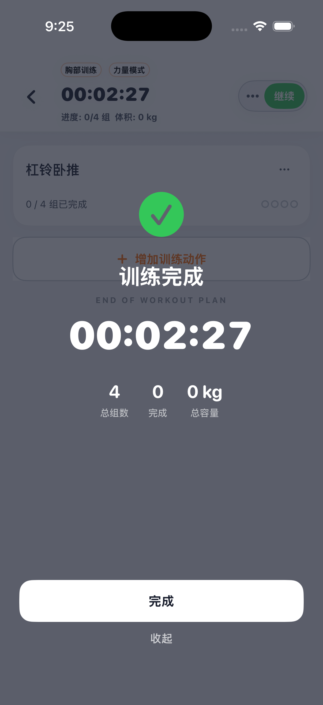 | 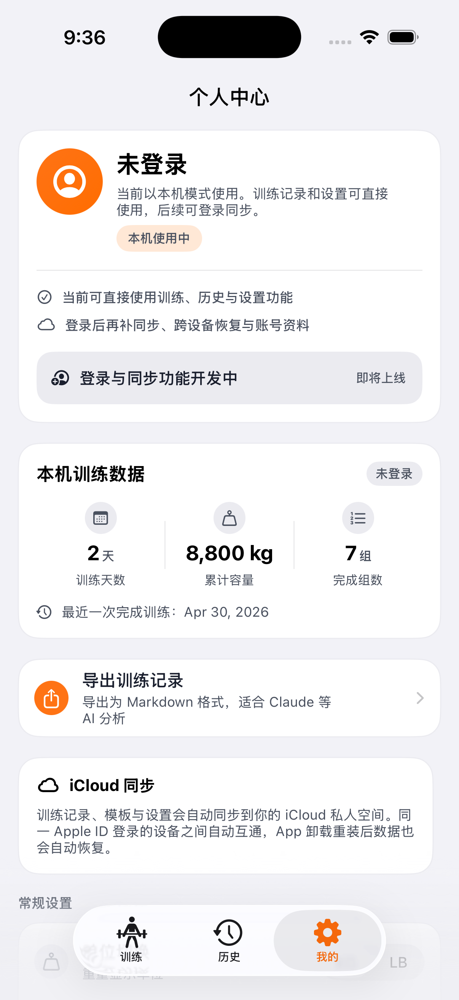 |

| History calendar | History list | History detail |
|---|---|---|
| 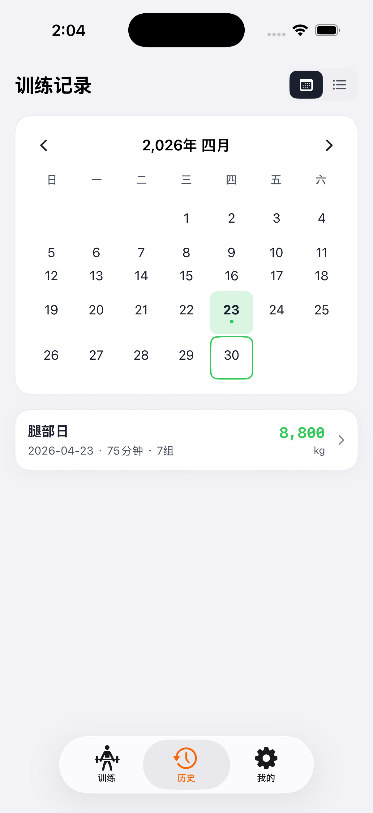 | 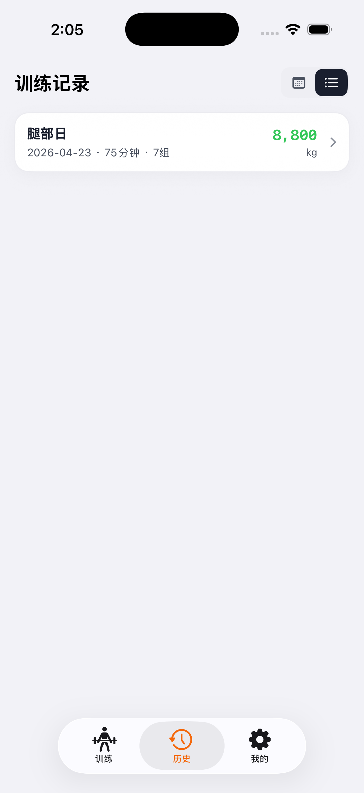 | 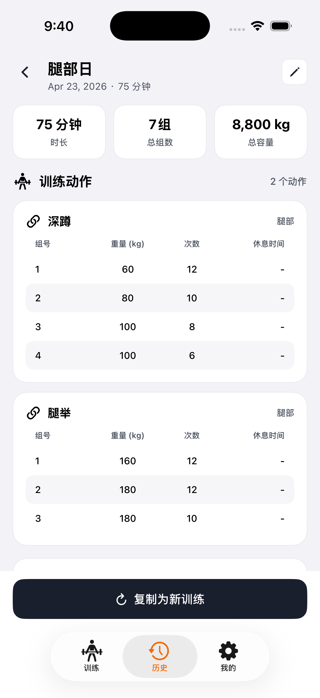 |

</details>

<details>
<summary><strong>Dark mode</strong></summary>

| Home | History calendar | History list | History detail |
|---|---|---|---|
|  |  |  | 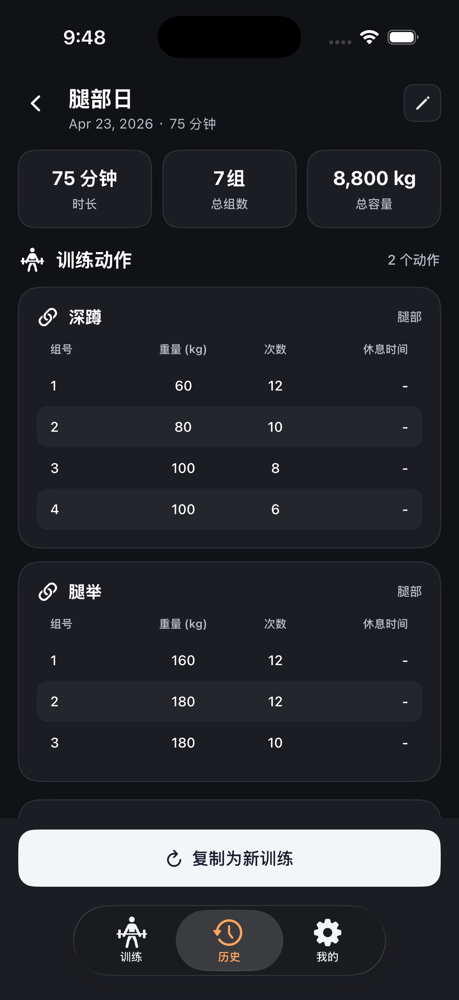 |

</details>

<!-- TODO: refresh screenshots after the new 14-session seed lands, so the dashboards reflect the richer demo state. -->

---

## Tech stack

| Layer | Technology |
|---|---|
| UI | SwiftUI (declarative, MainActor‑isolated) |
| Persistence | SwiftData (`@Model`) with iCloud sync ready |
| Notifications | `UserNotifications` (local rest‑timer alerts) |
| Icons | SF Symbols |
| Minimum OS | iOS 26.2 |
| Toolchain | Swift 5.0 · Xcode 16+ |

---

## Getting started

```bash
git clone https://github.com/<your-org>/SetLog.git
cd SetLog
open SetLog.xcodeproj
```

Then pick an iOS Simulator and **Cmd ⌘ + R**. The 14 demo sessions seed automatically on first launch — no extra steps.

To wipe the local store and re‑seed:
- **Simulator**: long‑press the app icon → Remove App → re‑run.
- **Device**: delete the app, then re‑run from Xcode.

> Existing users (with real data already synced via iCloud) will **not** have the demo data injected. The seeder treats any non‑empty session table as a restored install.

---

## Project structure

```
SetLog/
├── SetLog/
│   ├── SetLogApp.swift             // App entry — wires SwiftData ModelContainer + SampleDataSeeder
│   ├── ContentView.swift           // Tab root: Train · History · Profile
│   ├── Item.swift                  // All @Model types + Export/Seed DTOs + SampleDataSeeder
│   ├── CurrentWorkoutView.swift    // Live workout UI (timer, sets, rest)
│   ├── WorkoutTemplatesView.swift  // Template browser
│   ├── TemplateDetailView.swift    // Template editor / "start workout"
│   ├── AddExerciseView.swift       // Catalog browser + custom exercise editor
│   ├── HistoryView.swift           // Calendar + list of past sessions
│   ├── HistoryDetailView.swift     // Per-session breakdown + charts
│   ├── MacrocycleHomeView.swift    // Periodization landing
│   ├── MacrocycleSetupView.swift   // New-program wizard
│   ├── MesocycleEditorView.swift   // Per-phase config
│   ├── MesocycleEngine.swift       // Week/day index resolution
│   ├── ProfileView.swift           // Stats + export sheet
│   ├── NumericKeyboard.swift       // Custom 4×4 keypad (UIViewRepresentable)
│   ├── AppTheme.swift              // Color tokens
│   └── DemoSessions.json           // Seed data (replaceable)
└── screenshots/                    // App Store-ready captures
```

---

## Roadmap & known limitations

- **UI strings are currently Simplified Chinese only.** Migration to a String Catalog is on the roadmap.
- **No JSON import UI yet.** Only export exists; importing requires replacing `DemoSessions.json` and reinstalling. A Profile‑sheet importer is planned.
- **Exercise catalog edits don't sync across iCloud yet** — they're treated as device‑local seeds.

PRs welcome — see open issues for scoped tasks.

---

## License

Released under the [MIT License](LICENSE). Demo data, screenshots, and templates are released under the same terms.
